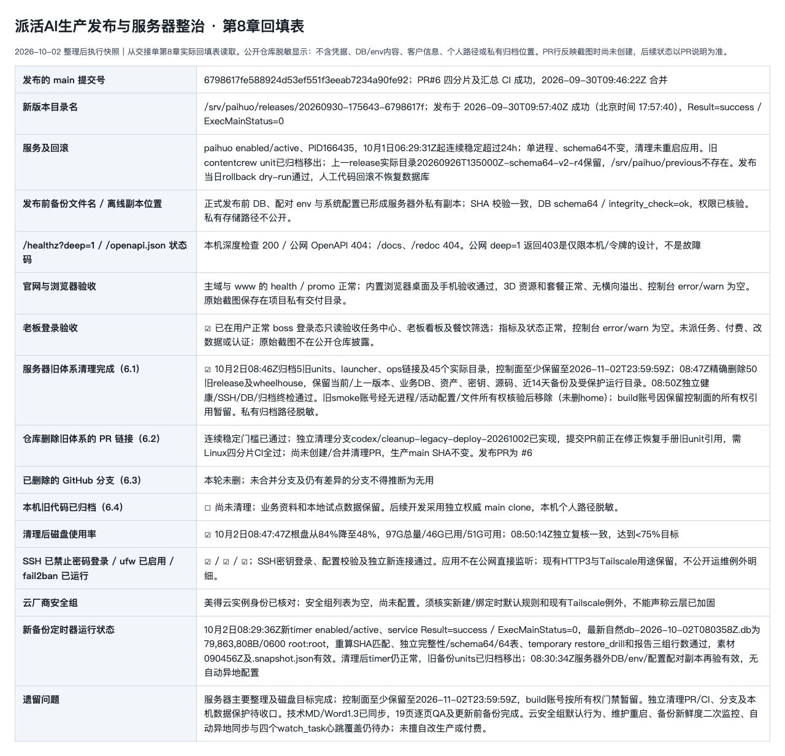

# 2026-10-02 旧部署体系退役证据（公开脱敏）

此记录支持独立的仓库清理 PR，不是一次新生产发布。生产仍使用
`6798617fe588924d53ef551f3eeab7234a90fe92`、release
`20260930-175643-6798617f` 和 schema64；本 PR 未合并、未部署。

## 已执行的服务器步骤

- 应用最后一次启动为 2026-10-01T06:29:31Z（普通自动安全更新的
  needrestart 显式重启，非崩溃）。10月2日08:27Z已核验连续稳定超过24小时，
  使用 PID、启动时刻和 systemd journal 共同判断，未只依据 NRestarts=0。
- 正常老板登录态的任务中心、老板看板/餐饮筛选已只读验收。
- 清理前最新自然 backup-simple 备份的大小、权限、SHA256、独立只读
  DB 完整性/schema64/64表及 temporary restore_drill 已通过；报告三个
  64键行数字典相同。另有服务器外 DB/env/系统配置配对副本核验通过。
  自动异地同步尚未配置，不能把人工配对副本称为自动异地备份。
- 08:46Z归档5个旧 units、旧 launcher、ops 软链接和45个实际历史 ops
  目录；运维 tar 共883成员，普通文件与源逐个 hash 验证一致。
  控制面移动到私有归档，至少保留至 `2026-11-02T23:59:59Z`。
- 08:47Z仅逐一删除已核验的50个旧 release 及 wheelhouse。
  保留 current 和上一实际 release `20260926T135000Z-schema64-v2-r4`，
  保留应用 DB、资产、env、密钥、源码、近14天备份及受保护运行目录。
  `previous` 链接不存在，不能假定它是回滚目标。
- 磁盘使用率从84%降至48%，可用约51G。08:50Z独立只读终检验证
  SSH/健康/DB/备份、无活动旧路径引用、归档完整性均通过；应用未手动重启。
- 旧 smoke 账号在无进程、无活动配置引用、全根同设备文件所有权为0后
  移除，未删 home；build 账号因保留控制面的文件所有权引用暂留。

旧 release 和 wheelhouse 实体不再是直接回滚点；重建须查 Git 历史和旧
制品。运维归档可用于恢复 units/launcher/ops，但不是全部旧 release 的
完整备份。控制面不可提前删除，build 账号须期满重新核验。

## 第8章回填表截图

截图从真实交接单第8章表格经本机只读 HTML 视图渲染，由 Codex 内置浏览器
完整截取，不是生产页面截图或合成演示。公开视图对私有路径、原始登录
截图位置和运维例外明细脱敏，不包含 DB/env 内容、客户信息或凭据。
截图时清理 PR 尚未创建，后续 PR/CI 状态以 PR 页面为准。

## 仓库边界与未完成事项

本次只退役旧部署状态机、专属 units/guard/launcher/专属测试；simple 所用
`build_release`、`preflight`、`verify_release`、`backup_db`、`verify_backup`、
`backup_health`、`failure_alert`、session-secret、boss 密码工具和 Caddy 配置
保留。当前恢复手册必须采用 `paihuo` 和 `paihuo-backup-simple`，停止真实
应用后再替换配对 DB/env，不能停旧服务后误以为应用已停止。

合并前必须通过 Linux 四分片全量 CI 及汇总 `test`。本机旧代码/试点数据、
有差异或未合并的分支仍保留；云安全组默认行为、维护重启、备份新鲜度
二次监控、自动异地同步和四个 watch_task 的实际心跳覆盖仍待单独处理。
未续费、未购买 ESM、未升级发行版、未重置老板密码、未关停 Tailscale，
未改变自动安全更新策略或未经确认发送厂商工单。
